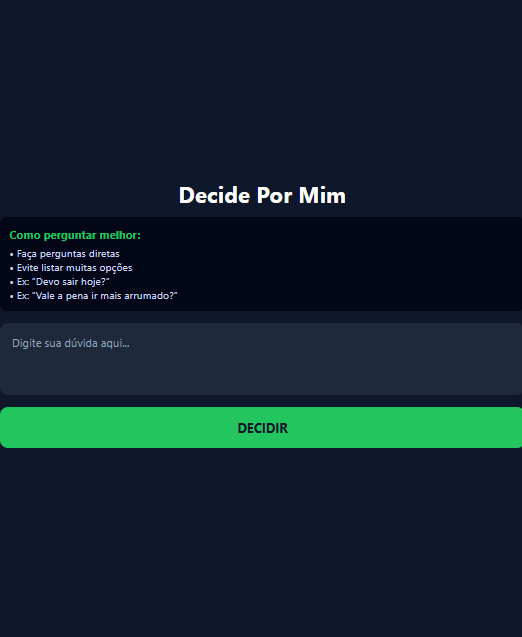
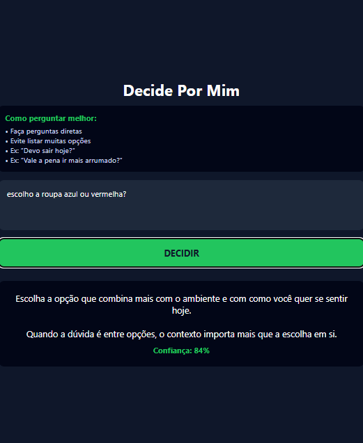

# 📱 Decide Por Mim

Aplicativo mobile criado para ajudar pessoas a tomarem decisões rápidas do dia a dia de forma simples, direta e sem complicação.

---

## 🧠 Visão Geral

O **Decide Por Mim** analisa o tipo de pergunta feita pelo usuário (decisão simples, escolha entre opções ou dúvida emocional) e retorna uma resposta orientativa baseada em lógica local.

O foco do projeto é reduzir indecisão e fadiga mental, oferecendo uma experiência clara, rápida e funcional — sem necessidade de cadastro ou internet.

---

## 🚀 Funcionalidades

- Análise do tipo de pergunta
- Respostas orientativas e diretas
- Funciona 100% offline
- Interface simples e intuitiva
- UX guiado com dicas de uso
- Ícone e splash screen personalizados
- APK gerado via EAS Build

---

## 🛠 Tecnologias Utilizadas

- React Native
- Expo
- JavaScript / TypeScript
- EAS (Expo Application Services)

---

## 📸 Capturas de Tela

### Splash Screen

### Tela Principal

### Resposta Gerada

---

## 📦 APK para Teste

📲 Baixe e teste o aplicativo Android:

👉 **[Download do APK](https://expo.dev/accounts/wbl/projects/decide-por-mim/builds/362c5aea-d63e-40a6-933e-408a8de221a6)**

---

## 📌 Status do Projeto

✅ Versão 1.0 concluída  
📱 Aplicativo funcional  
🚀 Pronto para portfólio e publicação  

---

## 👨‍💻 Autor

**Wesley Bernardino Lopes**  
Projeto desenvolvido do zero para fins de aprendizado, prática profissional e portfólio.
